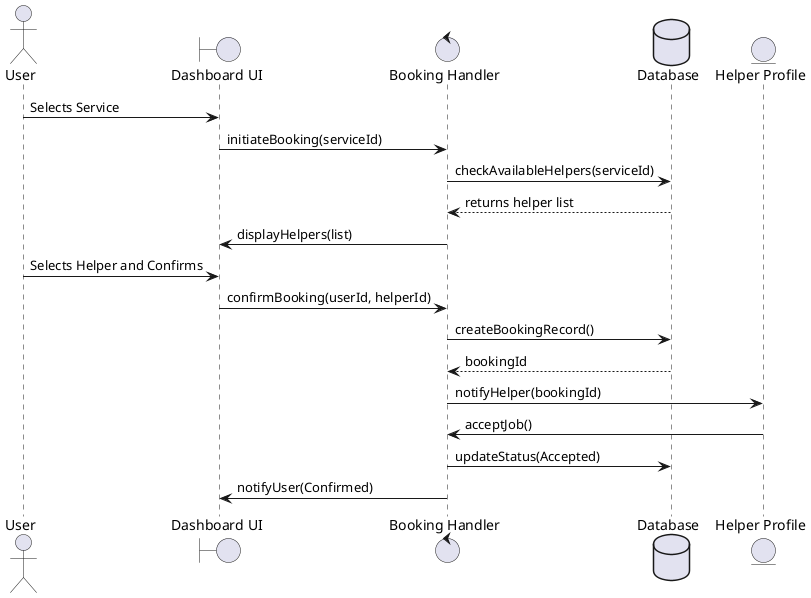
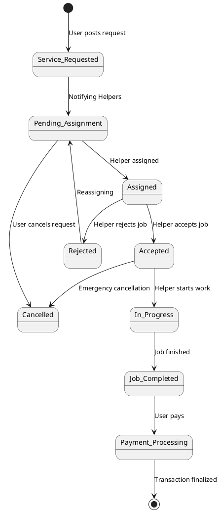
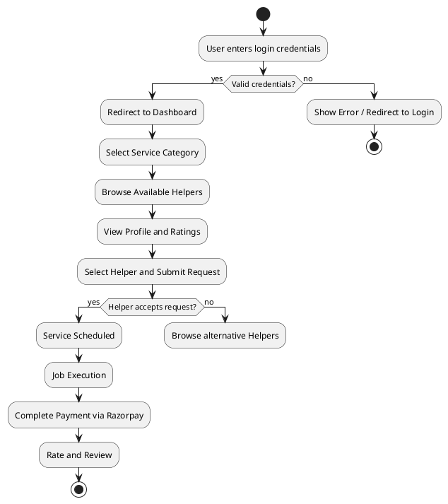
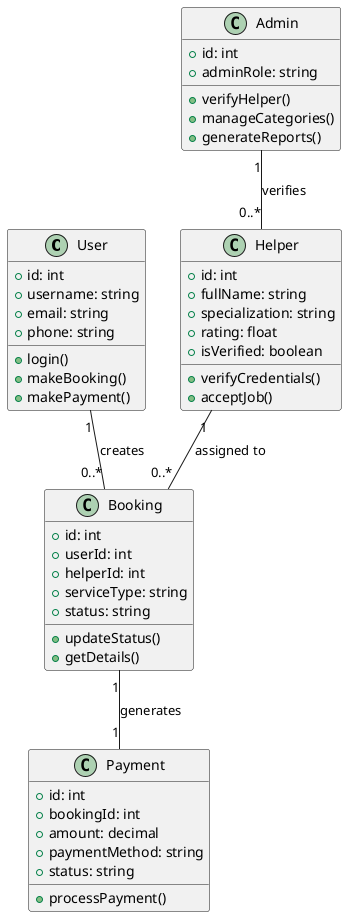
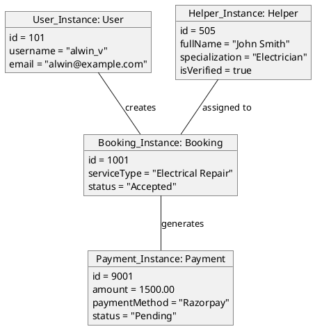
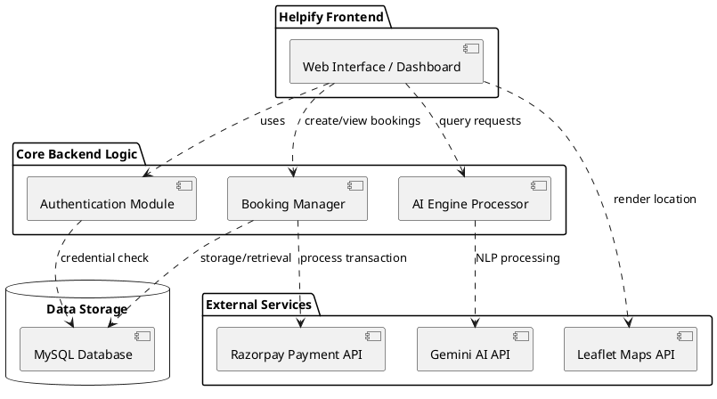
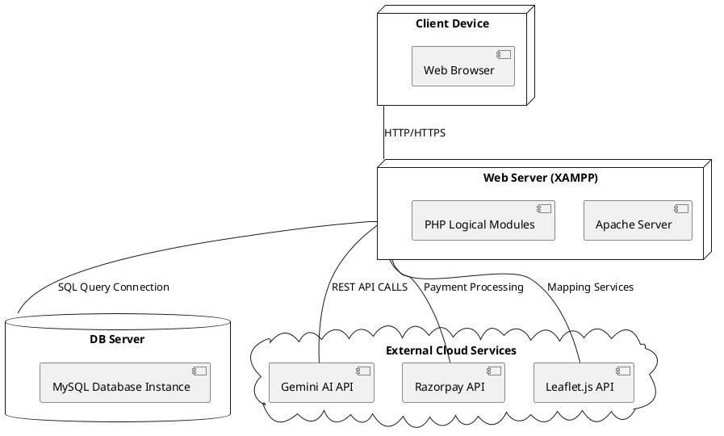
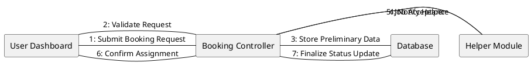

**1.1 PROJECT OVERVIEW**

Helpify is a web-based, multi-service marketplace platform developed to manage and streamline household and professional service bookings digitally. The system integrates customers, service providers (helpers), and administrators into one centralized and efficient platform. It allows users to register, browse through diverse service categories such as cleaning, cooking, and plumbing, and view and select from multiple verified helpers for their specific requests. Helpers can create professional profiles, accept and manage available tasks, and manage their service schedules through an intuitive dashboard. The administrator monitors the entire platform, verifies helper credentials, and ensures secure financial management and automated report generation. Helpify reduces the manual effort of finding reliable service providers, enhances market transparency through its innovative service allocation system, ensures secure data and payment management via Razorpay integration, and elevates the overall quality and efficiency of home service interactions.

**1.2 PROJECT SPECIFICATION**

Helpify is an on-demand service marketplace designed to integrate users, helpers, and administrators into a single centralized platform. The system is designed to digitize and streamline the process of finding and booking local services, ensuring market transparency, secure data management, and smooth interaction between stakeholders.

**Technology Stack Used**
*   **Frontend: HTML, CSS, JavaScript**
*   **Backend: PHP**
*   **Database: MySQL**
*   **Server: XAMPP**

**User Roles**
*   **Admin** – Manages the entire platform, verifies helper credentials, controls role permissions, and oversees system settings and service categories.
*   **Helper** – Creates professional profiles, views available booking requests in their area, manages service requests, and manages their task schedules.
*   **User** – Registers and logs in, interacts with the AI Concierge for service discovery, posts booking requests, manages bookings, and makes secure payments.

**Key Modules**
*   Authentication & Role-Based Access Control
*   AI Concierge & Natural Language Processing (NLP)
*   Multi-Helper Management & Service Booking System
*   Razorpay Payment Gateway Integration
*   Admin & Helper Dashboard Analytics
*   Voice User Interface (VUI) for Accessibility

**Security & Performance**
*   Secure login with session management
*   Role-based authorization
*   Centralized database with data sanitization
*   Responsive user interface for desktop and mobile access

Helpify ensures improved operational efficiency, reduced manual labor for finding reliable helpers, and enhanced service quality through a reliable and secure digital marketplace system.

**2.0 SYSTEM STUDY**

**2.1 INTRODUCTION**

The System Study is a critical phase in the development of **Helpify**, where the requirements and operational workflows are analyzed to ensure the feasibility and effectiveness of the proposed platform. This phase involves understanding the current challenges in the home service industry, identifying the needs of both service seekers (Users) and service providers (Helpers), and defining the system requirements. The primary goal is to transition from a fragmented, often unreliable manual process of finding local help to a structured, transparent, and AI-assisted digital marketplace. By conducting this study, we ensure that the platform is technically sound, economically viable, and operationally efficient, providing a secure and seamless experience for all stakeholders involved in the ecosystem.

**2.2 EXISTING SYSTEM**

The existing system for finding household and professional help is largely manual, informal, and fragmented. Customers typically rely on word-of-mouth recommendations, local classified ads, or physically searching in their neighborhoods to find service providers like cleaners, plumbers, or cooks. This process is highly inefficient and lacks transparency in pricing and reliability. On the other hand, service providers often struggle to find consistent work and have limited means of showcasing their skills or negotiating fair wages. There is no centralized platform to facilitate communication, manage bookings, or provide secure payment options. The lack of a formal verification process also poses security risks for both users and helpers, making the entire domestic service sector unpredictable and difficult to manage.

**2.3 DRAWBACKS OF EXISTING SYSTEM**

*   Time-consuming manual service record maintenance
*   High risk of data loss and booking misplacement
*   Lack of real-time service tracking and helper arrival monitoring
*   Poor coordination between users, helpers, and financial settlement
*   No centralized platform monitoring by administrator
*   Difficulty in generating automated daily/weekly service reports
*   No digital service allocation or tracking system
*   No integrated rating and review management system

**2.4 PROPOSED SYSTEM**

The proposed system, **Helpify**, is a fully integrated web-based application that connects users, helpers, and administrators in one centralized platform. It provides features such as an AI-integrated concierge for automated service discovery, a multi-helper management system, Voice User Interface (VUI) support, secure Razorpay payment gateway integration, real-time booking management, and comprehensive admin analytics. The system ensures secure login with role-based access control, centralized database management, and real-time monitoring of the entire service marketplace workflow.

**2.5 ADVANTAGES OF PROPOSED SYSTEM**

*   Streamlined and automated service discovery and booking processes
*   Market-driven transparent pricing through real-time service availability
*   Enhanced safety and reliability through verified helper profiles
*   Secure, cashless transactions via integrated Razorpay payment gateway
*   Improved user accessibility with AI Concierge and Voice Support (VUI)
*   Centralized monitoring and efficient data management for administrators
*   Real-time tracking of service requests and professional helper status
*   Automated generation of reports for business analysis and audit trails

**3.0 SYSTEM ANALYSIS**

Helpify's viability is confirmed through its technical, economic, and behavioral feasibility, validated by a formal research questionnaire administered to explore market readiness and technical expectations. Built on a stable PHP/MySQL stack with Gemini AI and geolocation integration, the platform is technically reliable and scalable. Economically, the use of open-source tools minimizes development costs, while behaviorally, the findings from the feasibility survey confirmed that the intuitive UI and AI Concierge simplify the transition from informal booking by addressing core user needs for trust and transparency.

A structured feasibility study questionnaire was used to gather data from urban service seekers and local helpers to identify the primary pain points in traditional word-of-mouth service discovery. This research focused on evaluating current barriers to entry, such as pricing ambiguity and the lack of verified credentials, while gauging the willingness of stakeholders to transition to an AI-assisted marketplace. The findings provided critical insights into digital literacy and feature priorities, confirming that a centralized platform with real-time mapping and secure digital payments is highly desired by the target community.

**3.1 FEASIBILITY STUDY QUESTIONNAIRE**

**1. How do you currently find and hire domestic or professional helpers?**
Domestic and professional helpers are currently found primarily through word-of-mouth recommendations from friends or neighbors, or by physically searching in local markets. This manual process is time-consuming and often results in limited options, as there is no centralized directory to browse available providers or compare their specific specializations effectively.

**2. What challenges do you face regarding pricing transparency with current providers?**
Pricing is currently negotiated on a case-by-case basis without any standardized rates or market-driven benchmarks. This lack of transparency leads to inconsistent pricing, where different users may pay vastly different amounts for the same service, causing dissatisfaction and making it difficult for both parties to reach a fair agreement.

**3. How do you verify the background and reliability of a new helper?**
Verifying the background and reliability of helpers is extremely difficult in the current informal system. Most users rely solely on the verbal assurance of the person recommending them, as there is no formal registration, credential verification, or centralized rating system to check past performance and reliability records.

**4. What difficulties do you encounter when scheduling or rescheduling a service?**
Scheduling is handled through direct phone calls or physical visits, which often leads to miscommunication, double-bookings, or helpers failing to arrive at the agreed-upon time. Without a digital calendar or real-time status updates, managing rotating shifts or emergency rescheduling is nearly impossible and causes significant inconvenience.

**5. How are service requests tracked and managed once a job is agreed upon?**
Service requests are currently managed through verbal agreements or handwritten notes, which are prone to being forgotten or misplaced. There is no real-time tracking of when a helper has started a job, their expected arrival time, or a formal log of completed tasks for future reference and administrative auditing.

**6. What issues arise during the payment process for domestic services?**
Payments are primarily made in cash, which lacks an audit trail and can lead to disputes over the amount paid or the specific work completed. The absence of a secure digital payment gateway makes it difficult to manage advance payments, provide automated receipts, or maintain professional financial records.

**7. How do independent helpers currently discover and accept new job opportunities?**
Helpers currently depend on their existing network of clients to find new work, which severely limits their earning potential and geographic reach. They lack a platform to showcase their specialized skills to a wider audience or to receive instant notifications of available jobs in their immediate vicinity.

**8. What limitations exist in the current way service quality is reported or reviewed?**
There is no formal mechanism for users to provide feedback or for other users to benefit from past experiences. Negative incidents often go unreported beyond a small social circle, allowing unreliable providers to continue working without accountability, while high-quality helpers struggle to build a verified reputation.

**9. How do you manage emergency or on-demand service requirements?**
On-demand services are managed by calling multiple known contacts until someone is available, which is highly inefficient during emergencies like pipe bursts or electrical failures. The current system lacks a real-time availability engine where users can post a request and receive multiple acceptances within minutes from nearby pros.

**10. What difficulties arise in maintaining a clear history of previous bookings and expenses?**
Booking histories and expenses are rarely recorded in the manual system, making it difficult for users to track their monthly spending on household services. The lack of a digital dashboard means that users have no point of reference for recurring services or for auditing their historical interactions with specific helpers.

**11. How is a helper's professional growth and skillset currently documented?**
A helper's professional growth is entirely undocumented, as there is no centralized profile where they can list certifications, specialized training, or accumulated years of experience. This prevents them from negotiating higher wages based on proven expertise or scaling their small service businesses beyond manual labor.

**12. What is the overall sentiment toward adopting a digital platform for service management?**
There is a strong willingness among both users and helpers to adopt a digital solution that provides structure, security, and efficiency. Stakeholders are particularly interested in features like AI-assisted discovery, transparent rating systems, and secure mobile payments to solve the inherent unreliability and fragmentation of the current informal marketplace.

**3.2 SYSTEM SPECIFICATION**

**3.2.1 Hardware Specification**

Processor – Intel i3 or above
RAM – 4 GB or above
Hard Disk – 500 GB
Network – Stable Internet Connection

**3.2.2 Software Specification**

Front End – HTML5, CSS3, JavaScript, AJAX, jQuery
Back End – PHP
Database – MySQL
Server – XAMPP (Apache Server)
Client on PC – Windows 7 and above
Web Browser – Google Chrome / Microsoft Edge
Technologies used – JS, HTML5, PHP, CSS, Gemini API, Leaflet.js, Razorpay API

**3.3 SOFTWARE DESCRIPTION**

The software architecture of Helpify is built on a robust and scalable stack designed to handle the dynamic requirements of a modern service marketplace. The backend is powered by PHP, a versatile server-side scripting language that manages the core business logic, user authentication, and communication between the frontend and the database. PHP ensures that session management and role-based access control are handled securely, providing a seamless transition between user, helper, and admin interfaces. Supporting the backend is MySQL, a powerful relational database management system that stores and retrieves critical data such as user profiles, helper credentials, service categories, and transaction histories. MySQL's efficiency in handling complex queries ensures that real-time service matching and report generation are performed with minimal latency.

On the frontend, Helpify utilizes a combination of HTML5, CSS3, and JavaScript to deliver a premium, responsive user experience. The interface follows a modern glassmorphism design language, providing a sleek and intuitive environment for users to discover services. Advanced interactivity is achieved through AJAX and jQuery, allowing for asynchronous data updates that enable real-time notifications and dynamic dashboard analytics without requiring full page reloads. The platform also integrates sophisticated APIs to enhance its functionality, including the Gemini AI API for processing natural language service requests and Leaflet.js for embedding interactive maps that facilitate proximity-based helper matching. By combining these technologies, Helpify provides a stable, highly accessible, and feature-rich environment tailored for the domestic service industry.

**4.0 SYSTEM DESIGN**

**4.1 INTRODUCTION**

The System Design phase translates functional requirements into a technical blueprint, defining the architecture, UI/UX flow, and data structures. It emphasizes a mobile-first, modular approach using a glassmorphism aesthetic and AI-driven navigation.

**4.2 UML DIAGRAM**

UML diagrams are used to visualize and document the platform's architecture. Use Case Diagrams map actor interactions, Sequence Diagrams detail workflow logic like booking and payments, and Class Diagrams define the relational database schema.

**4.2.1 USE CASE DIAGRAM**

The Use Case Diagram illustrates interactions between Users, Helpers, and Administrators. It captures core actions like AI-assisted discovery, service booking, profile management, and administrative oversight, defining the functional scope of the multi-role marketplace.

**4.2.2 SEQUENCE DIAGRAM**

The Sequence Diagram documents the step-by-step chronological interaction between various system objects and actors, focusing on the dynamic logic of specific workflows. It illustrates how the frontend components communicate with backend processors and databases to complete a task, such as the transition from a user selecting a service to the final confirmation by a helper.

**4.2.3 STATE CHART DIAGRAM**

The State Chart Diagram depicts the various states an object passes through during its lifecycle and the transitions that occur as a result of specific events. In the context of Helpify, this diagram models the lifecycle of a **Service Request**, from the initial creation to the final completion or cancellation, ensuring all possible statuses are accounted for in the system logic.

**4.2.4 ACTIVITY DIAGRAM**

The Activity Diagram provides a visual representation of the step-by-step workflow of the Helpify platform, emphasizing the operational flow and decision logic between different actions. It maps out the sequence from a user’s initial login through service selection and helper assignment, highlighting the conditional paths like successful authentication and helper availability.

**4.2.5 CLASS DIAGRAM**

The Class Diagram provides a static structural view of the Helpify platform, defining the primary entities, their internal attributes, and the relational associations between them. It illustrates how various object classes like **User**, **Helper**, and **Admin** are structured and how they interact with operational classes like **Booking**, **Service**, and **Payment** to maintain data integrity across the marketplace.

**4.2.6 OBJECT DIAGRAM**

The Object Diagram provides a snapshot of the actual instances of classes at a specific point in time during the Helpify platform's operation. It captures a concrete scenario of the system's state, illustrating specific data values for objects like a particular **User**, an assigned **Helper**, and their linked **Booking** and **Payment** records to demonstrate real-world system behavior.

**4.2.7 COMPONENT DIAGRAM**

The Component Diagram represents the physical partitioning of the Helpify platform into modular software units and the dependencies between them. It illustrates the high-level architecture of the system, showing how the **Frontend UI** interacts with specialized backend modules like the **Auth Handler**, **AI Engine**, and **Booking Manager**, as well as external integrations such as the **Razorpay API** and the **Gemini AI API** to provide its core marketplace features.

**4.2.8 DEPLOYMENT DIAGRAM**

The Deployment Diagram details the physical layout of the software components across the environment’s hardware. For the Helpify platform, the diagram shows the mapping between the user devices (Desktop or Mobile Web Browser) and the application's central hosting environment, as well as the connections to essential cloud-based APIs like Gemini for AI processing and Razorpay for secure marketplace transactions.

**4.2.9 COLLABORATION DIAGRAM**

The Collaboration Diagram (or Communication Diagram) illustrates the organizational structure and interactions between objects that collaborate to perform a specific behavior. In the Helpify platform, this diagram focuses on the links between objects like the **User Dashboard**, the **Booking Controller**, and the **Helper Module**, highlighting the flow of numbered messages as they work together to confirm a marketplace transaction.

